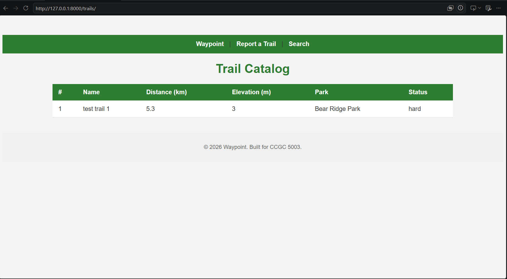
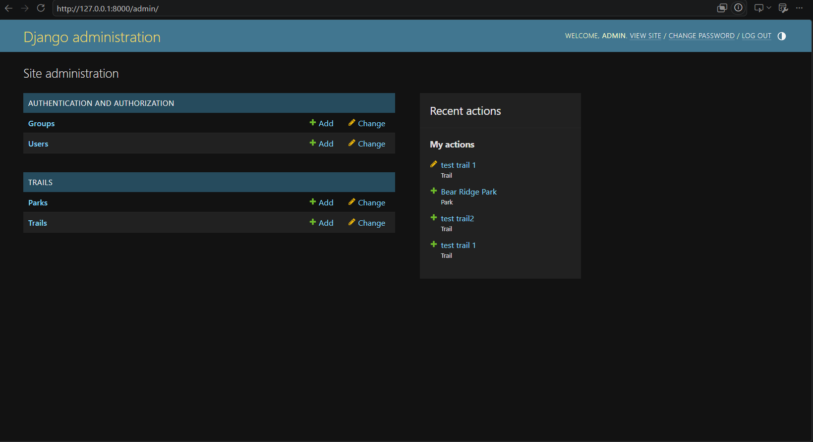
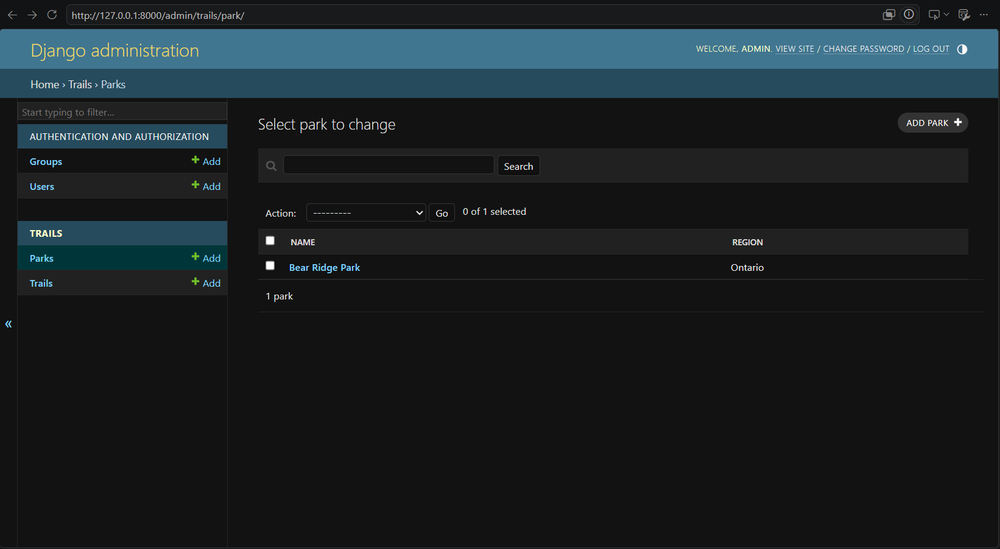
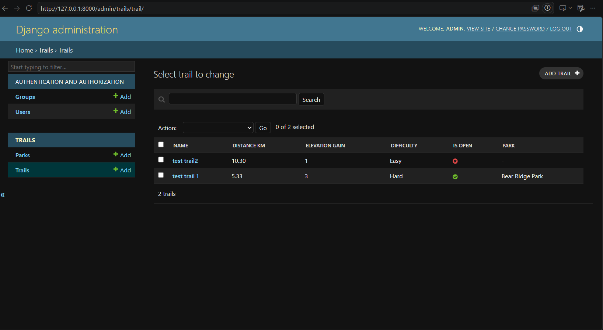

# Waypoint

A trail-finder and trip-planner app. Built solo across 8 weeks: first a
pure-Python domain engine (Weeks 7-8), then a Django web app around it
(Weeks 9-14).

## Status
Week 7 complete (tagged `w7`) — domain engine finished (Distance, Trail, Itinerary).
Week 8 complete (tagged `v8`) — trail hierarchy, operator overloading, mixins, polymorphism.
Week 9 complete (tagged `v9`) — Django project set up (venv, Django 4.2, dev server verified).
Week 10 complete (tagged `v10`) — homepage, trail-report form with CSRF protection, search view.
Week 11 complete (tagged `v11`) — shared base layout, trail catalog with badges and filters.
Week 12 complete (tagged `v12`) — Trail model, migrations, admin panel, database-backed catalog at /trails/.
Week 13 complete (tagged `v13`) — Park model, ForeignKey relationship (Trail→Park, SET_NULL), relation surfaced in admin/catalog, cross-relation query.
Week 14 complete (tagged `v1.0`) — automated tests, finalized README, final release.

## Project structure
- `waypoint_core/` — pure-Python domain classes
  - `distance.py` — Distance (validated, immutable, operator-overloaded)
  - `trail.py` — Trail (abstract base class)
  - `day_hike.py`, `backpacking_route.py`, `trail_run.py` — concrete Trail subclasses
  - `guided_day_hike.py` — extends DayHike (3rd inheritance level)
  - `mixins.py` — ElevationMixin, RatingMixin
  - `rated_backpacking_route.py` — composed class using both mixins
  - `itinerary.py` — Itinerary (ordered trail list, total distance)
- `waypoint/` — Django project settings and configuration
  - `settings.py` — project configuration (apps, database, templates, static files)
  - `urls.py` — maps URLs to views
  - `views.py` — view functions (home, report, search, catalog)
- `trails/` — Django app for trail data
  - `models.py` — Trail model, Park model, ForeignKey (Trail→Park, on_delete=SET_NULL)
  - `admin.py` — TrailAdmin and ParkAdmin registration
  - `views.py` — catalog(), trails_by_park() (cross-relation query), trail_detail() (404 on missing trail)
  - `urls.py` — trails app routes, mounted at /trails/ via include()
  - `migrations/` — 0001_initial.py (Trail table), 0002_park_trail_park.py (Park table + FK)
  - `tests.py` — automated tests (open-trails query, detail 404, Distance domain rules)
- `templates/` — HTML templates (base.html, home.html, report.html, thank_you.html, search.html, catalog.html, trail_detail.html)
  - `partials/` — navbar.html, footer.html (included via ``)
- `static/` — CSS (style.css)
- `screenshots/` — README screenshots (catalog, admin panel)
- `manual_tests/` — manual test scripts for waypoint_core from Weeks 7-8 (not part of the automated suite)
- `manage.py` — Django's command-line entry point (runserver, migrate, test, etc.)
- `requirements.txt` — pinned dependencies for a fresh install

## Running the project

1. Clone the repo and `cd` into it.
2. Create and activate a virtual environment (requires **Python 3.12** — Django 4.2 is incompatible with Python 3.14):
   ```
   py -3.12 -m venv env
   ```
   Windows: `env\Scripts\Activate.ps1`
   Mac/Linux: `source env/bin/activate`
3. Install dependencies:
   ```
   pip install -r requirements.txt
   ```
4. Apply database migrations:
   ```
   python manage.py migrate
   ```
5. (Optional) Create a superuser to access the admin panel:
   ```
   python manage.py createsuperuser
   ```
6. Run the automated test suite:
   ```
   python manage.py test
   ```
7. Run the development server:
   ```
   python manage.py runserver
   ```
8. Open `http://127.0.0.1:8000/` in your browser, or `http://127.0.0.1:8000/trails/` for the trail catalog.

## Screenshots

**Trail Catalog** — public-facing list of open trails, showing park and status badges


**Admin Panel** — site administration home


**Admin: Parks** — managing parks


**Admin: Trails** — managing trails, including park assignment

